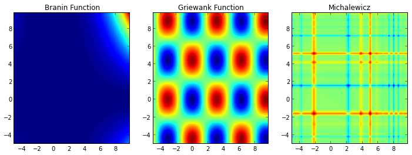
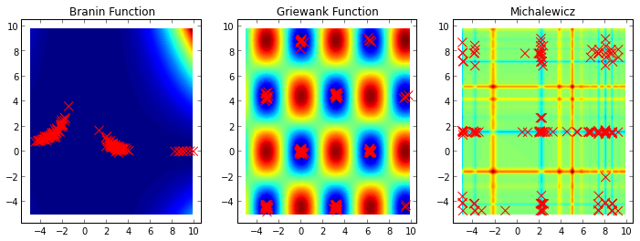

# Harmony Search Demonstration

Wherein we try to find global minima for three particularly hairy functions
using Harmony Search

    %pylab inline
    import harmony
    import numpy as np
    import matplotlib
    import matplotlib.pyplot as plt

    
    Welcome to pylab, a matplotlib-based Python environment [backend: module://IPython.zmq.pylab.backend_inline].
    For more information, type 'help(pylab)'.

## The Aforementioned Hairy Functions

    def branin(x):
        '''Vectorized Branin function'''
        a = 5.1 / (4. * np.pi**2)
        b = 5. / np.pi
        c = 10 * (1 - 1. / (8 * np.pi))
        return (((x[:, 1] - a) * x[:, 0]**2. + x[:, 0] * b - 6.)**2.
               + np.cos(x[:, 0]) * c + 10)
    
    def griewank(x, fr=4000):
        '''Vectorized Griewank'''
        s = np.square(x).sum(axis=1)
        p = np.ones_like(s)
        for j in xrange(x.shape[1]):
            p *= np.cos(x[:, j] / np.sqrt(j + 1))
        
        return s / fr - p + 1
        
    def mich(x, m=10):
        '''Vectorized Michalewicz Function'''
        m = 10;
        s = np.zeros(shape=(x.shape[0]), dtype=x.dtype)
        for i in xrange(x.shape[1]):
            s += np.sin(x[:, i])*(np.sin((i + 1) * x[:, i]**2. / np.pi))**(2*m)
        return -s

    def grid_plot2d(f, bx, by, res=0.1):
        '''Returns x, y, z. For use with plt.contour(x, y, z)'''
        X, Y = np.arange(bx[0], bx[1], res), np.arange(by[0], by[1], res)
        x, y = np.meshgrid(X, Y)
        r = np.dstack((x, y))
        r_2d = r.reshape((reduce(lambda a, b: a * b, r.shape[:-1]), r.shape[-1]))
        return x, y, f(r_2d)

    bx, by = (-5, 10), (-5, 10)
    res = 0.2
    x, y, z = grid_plot2d(branin, bx, by, res)
    x2, y2, z2 = grid_plot2d(griewank, bx, by, res)
    x3, y3, z3 = grid_plot2d(mich, bx, by, res)

    f = plt.figure(figsize=(12, 4))
    names = ('Branin Function', 'Griewank Function', 'Michalewicz')
    levels = 100
    for i, (a, b, c) in enumerate(((x, y, z), (x2, y2, z2), (x3, y3, z3))):
        ax = f.add_subplot(1, 3, i + 1)
        ax.contourf(a, b, c.reshape(a.shape), 100)
        ax.set_title(names[i])

## Enter Harmony Search!

For each function, we'll run a bunch of trials of Harmony Search, I've
arbitrarily set the 'Memory Size' (hms) to 50, and the iterations to 350.
Additionally, I've tuned the memory selection rate (gmcr) to 60%, this leads to
a little more exploration (better for the Mchalewicz function). Because we're
exploring more, I've also allowed the par to be a little higher, and the
corresponding step size (fw) a little smaller to compensate.

For each trial, I've plotted the solution as a (somewhat obnoxious) red 'X'. You
can see that the global minima within the search range are located near the
centroids of the  solution clusters. If we wanted to get *real*, we could then
run a kmeans clustering routine to find the best solutions.

    # Invert the signals to use hill-climbing HS.
    funs = (lambda q: -branin(q), 
            lambda q: -griewank(q),
            lambda q: -mich(q))
    trials = 150
    bounds = (bx, by)
    for i, a in enumerate(f.axes):
        hs = harmony.HarmonySearch(funs[i], bounds, hms=50, max_iter=350, gmcr=0.6, par=0.25, fw=0.05)
        s = [hs.execute() for t in xrange(trials)]
        s = np.vstack(s)
        a.scatter(s[:, 0], s[:, 1], marker='x', c='r', s=100.)

    f

